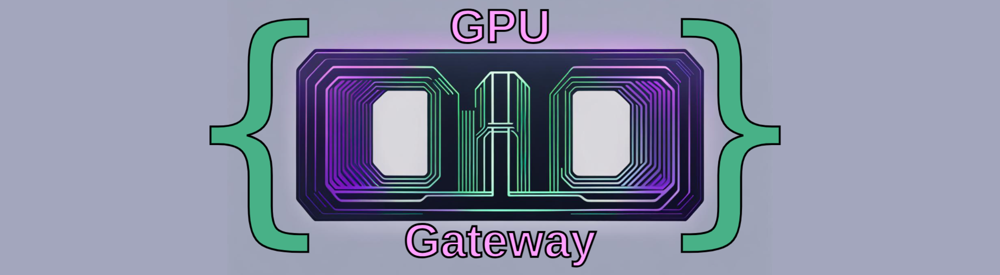

<!-- {"s_msg":"this file was automatically generated","s_by":"f_generate_markdown.module.js","s_ts_created":"Sat Dec 16 2023 12:37:56 GMT+0100 (Central European Standard Time)","n_ts_created":1702726676564} -->

## 1. import
```javascript
import {
    f_o_gpu_gateway, f_o_gpu_gateway__from_simple_fragment_shader, f_render_o_gpu_gateway
}
from './client.module.js'

```
## 2. create a canvas
```javascript
let o_canvas = document.createElement('canvas');
o_canvas.width = window.innerWidth
o_canvas.height = window.innerHeight
document.body.appendChild(o_canvas);

```
## 3. create the gpu gateway
```javascript
let o_gpu_gateway = f_o_gpu_gateway(
    o_canvas, 
    `#version 300 es
    in vec4 a_o_vec_position_vertex;
    out vec2 o_trn_nor_pixel;
    void main() {
        gl_Position = a_o_vec_position_vertex;
        o_trn_nor_pixel = (a_o_vec_position_vertex.xy + 1.0) / 2.0; // Convert from clip space to texture coordinates
    }`,
    `#version 300 es
    precision mediump float;
    // incoming variables
    in vec2 o_trn_nor_pixel;
    // outgoing variables
    out vec4 fragColor;
    void main() {
        fragColor = vec4(
            vec3(length(o_trn_nor_pixel)),
            1
        );
    }
    `,
)

```
## 4. render the gpu gateway
```javascript
f_render_o_gpu_gateway(
    o_gpu_gateway
);


```
### IALAF (i am lazy as f$#@) functions
this is one of the shortest way to get a shader!
```javascript
document.body.appendChild(f_o_gpu_gateway__from_simple_fragment_shader(
    `#version 300 es
    precision mediump float;
    in vec2 o_trn_nor_pixel;
    out vec4 fragColor;
    void main() {
        float n = length(
            o_trn_nor_pixel-.5
        ); 
        fragColor = vec4(
            vec3(sin(n*33.)),
            1
        );
    }
    `,
    500, 
    500
).o_canvas)


```
### errors,
upon an error you will get a rustlike error output
for example in the following we have multiple errors
```javascript
let o = f_o_gpu_gateway__from_simple_fragment_shader(
    `#version 300 es
    precision mediump float;
    in vec2 o_trn_nor_pixel;
    out vec4 fragColor;
    void main() {
        float n = length(
            o_trn_nor_pixel-vec3(.5) // we cannot subtract a vec3 from vec2
        ); 
        fragColor = vec4(
            vec3(sin(n_min*33.)), // use of undeclared identifier
            1
        );
    }}
    `,
    500, 
    500
);
document.body.appendChild(o.o_canvas);

```
the output will be like
```javascript
// ERROR '-'
//   |
// 7 |            o_trn_nor_pixel-vec3(.5) // we cannot subtract a vec3 from vec2
//   |                           ^ wrong operand types - no operation '-' exists that takes a left-hand operand of type 'in mediump 2-component vector of float' and a right operand of type 'const 3-component vector of float' (or there is no acceptable conversion)

// ERROR 'n_min'
//    |
// 10 |            vec3(sin(n_min*33.)), // use of undeclared identifier
//    |                     ^^^^^ undeclared identifier

// ERROR '}'
//    |
// 13 |    }}
//    |    -- syntax error


```